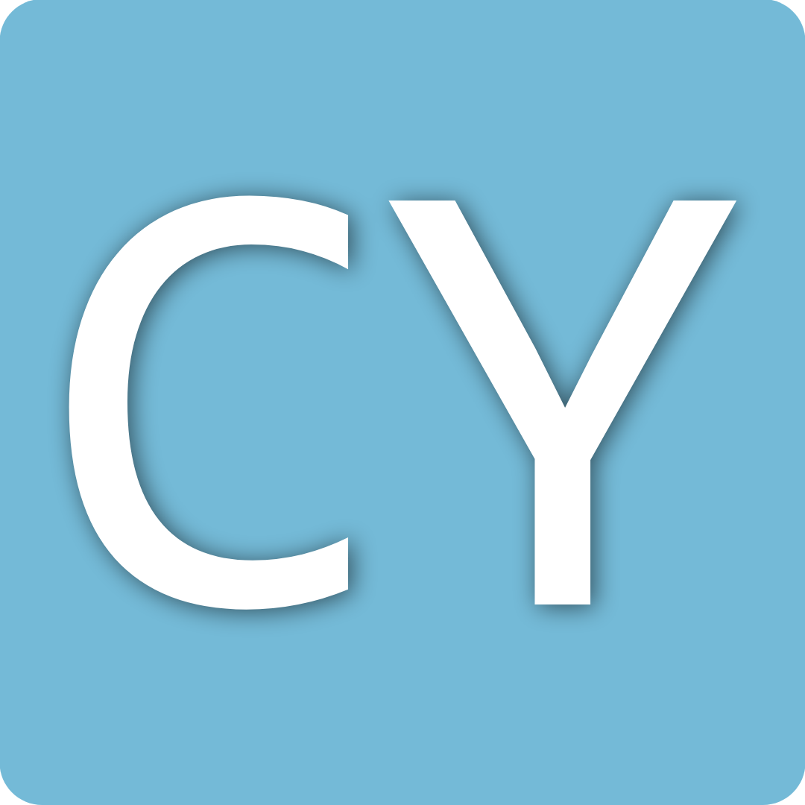

  

  <h1>Cylon</h1>

  

    A Minimalist Programming Language Built in C++
  

  

    :warning: This project is under heavy development and not in a usable state
  

# Installation
TODO: ADD INSTALLATION SECTION

# Documation
TODO: ADD DOCUMENTATION SECTION

# Contribution Standards
TODO: ADD CONTRIBUTION STANDARDS SECTION

# LICENSE
Cylon Source License (CSL)

Copyright (c) [2025] Synax0000

Permission is hereby granted, free of charge, to any person obtaining a copy of this software and associated documentation files (the “Software”), to use, copy, modify, merge, publish, distribute, and sublicense copies of the Software, including for commercial purposes, **subject to the following conditions**:

1. **Open Source Requirement**: Any fork, derivative work, or substantial usage of the Software must remain **fully open source** and licensed under this exact license. No alternative license may be used for any fork or derivative. This includes modifications, adaptations, or use of large portions of the code.

2. **Free Distribution**: The Software and all forks or derivatives must be **distributed entirely for free**. Freemium, donationware, or gated features that restrict full functionality unless payment is made are **not allowed**.

3. **Optional Paid Addons**: Forks may provide **paid, closed-source** addons, extensions, or plugins **only if**:

   * The base (free, open-source) version is fully functional and usable without them.
   * These paid additions do **not** restrict access to core functionality or features necessary for a typical or decent user experience.
   * Addons are supplementary, not essential.

4. **Attribution**: Any public use or distribution of the Software or derivatives must provide **clear credit** to:

   * "Synax0000"
   * The original repository: **"Cylon"**
   * Any forks of the "Cylon" repository used in the derivative must also be credited.
   * No attribution is required for unrelated third-party resources not covered under this license.

THE SOFTWARE IS PROVIDED “AS IS”, WITHOUT WARRANTY OF ANY KIND, EXPRESS OR IMPLIED, INCLUDING BUT NOT LIMITED TO THE WARRANTIES OF MERCHANTABILITY, FITNESS FOR A PARTICULAR PURPOSE, AND NONINFRINGEMENT. IN NO EVENT SHALL THE AUTHORS BE LIABLE FOR ANY CLAIM, DAMAGES, OR OTHER LIABILITY, WHETHER IN AN ACTION OF CONTRACT, TORT, OR OTHERWISE, ARISING FROM, OUT OF, OR IN CONNECTION WITH THE SOFTWARE OR THE USE OR OTHER DEALINGS IN THE SOFTWARE.
